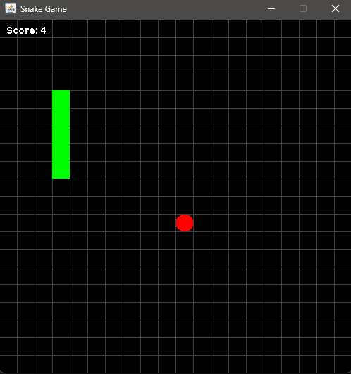

#  Snake Game in Java

A simple Snake game built using Java and Swing for the graphical user interface. The game allows you to control the snake using arrow keys, eat food to grow, and avoid obstacles. Press **R** to restart the game after it ends.



## 🛠 Requirements

⚠️ **IMPORTANT:** This game was compiled using **Java 24**.  
To run the `.jar` file, make sure you have **Java 24 or higher** installed on your system.

## 🐍 Features
- Control the snake with the arrow keys (Up, Down, Left, Right).
- Eat food to grow the snake and increase your score.
- Avoid walls and the snake's body to prevent the game from ending.
- Press **R** to restart the game after it ends.

## 🎯 How to Play
1. Start the game.
2. Use the arrow keys to move the snake around the screen.
3. Eat food (represented by small squares) to grow the snake and increase your score.
4. Avoid running into the wall or the snake's own body.
5. Press **R** to restart the game after it ends.

## How to Run

1. Clone the repository and navigate to the project directory:
   ```
   git clone https://github.com/icuarqm/SnakeGame.git
   cd SnakeGame
2. Run the Game:
   
   • Using the precompiled .jar File (JRE 24 Required):
   ```
   java -jar SnakeGame.jar
   ```
   • Compile and Run the Source Code Yourself:
   ```
   javac -d out src/main/*.java
   java -cp out main.Game
4. For Windows Users: Simply double-click the SnakeGame.exe file to start the game (JRE 24 Required).

## 📄 License

This project is licensed under the MIT License - see the LICENSE file for details.

## 🙌 Acknowledgements

Inspired by the classic Snake Game.

Thanks to the Java Swing documentation for helping with GUI development.
